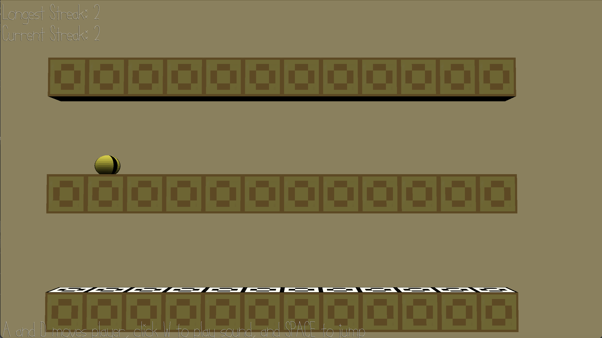

# Breaking the Sound Barrier

Author: Nellie Tonev

Design: This game is a platformer, where the platforms that you can jump through and those that block you
are visually indistinguishable. Players must listen to sound cues at their location to figure out where they can jump through to get to the platform above them.

Screen Shot:

How To Play:
* Use A and D to move your character horizontally across platform blocks at a particular level.
* Use W to play a sound that indicates whether the block above you is passable or not.
* Once you find the passable block, use the space bar to jump through it to the next platform.
* Try to get a good streak of jumping through platforms successfully without jumping into the solid blocks!

\
A feature that I would have liked to implement is having 3D rotation of the environment every time you jump to a new level, such that new platforms get added perpendicularly to the current orientation, and the camera rotates accordingly.
That way, the scene doesn't look the exact same as you jump from platform to platform. I also designed the platform blocks to have different colors on each side with this goal in mind, but unfortunately time constraints prevented that from 
being implemented. 

Thanks for playing :)

This game was built with [NEST](NEST.md).
